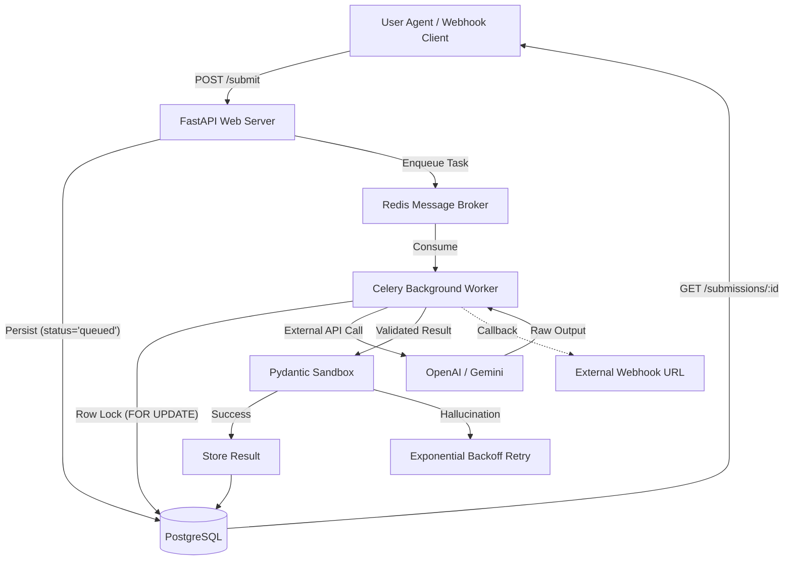

# AI Content Processing Pipeline

[](https://www.python.org/)
[](https://fastapi.tiangolo.com/)
[](https://docs.celeryq.dev/)
[](https://www.docker.com/)
[](https://opensource.org/licenses/MIT)

> **"A production-grade, asynchronous AI processing pipeline designed for scale and resilience."**

This repository demonstrates a **senior-level architecture** for handling high-latency AI workloads. Instead of blocking the client during slow LLM calls, it leverages a decoupled worker-queue pattern to ensure a snappy, high-performance API experience.

---

## Architecture



---

## Why This Repository Stands Out

| Feature | Engineering Decision |
| :--- | :--- |
| **Idempotent Workers** | Workers skip already-processed tasks, saving LLM costs and preventing duplicate state transitions. |
| **Row-Level Locking** | Uses `with_for_update()` to prevent race conditions when scaling to multiple workers. |
| **Request Tracing** | Every API response includes a unique `X-Request-ID` for end-to-end debugging in logs. |
| **Fault Tolerance** | Automatic retries with **Exponential Backoff** (1s ➝ 2s ➝ 4s ...) for transient LLM API errors. |
| **Strict Schema Guard** | LLM output is validated against a Pydantic schema before it ever touches the database. |
| **Webhook Delivery** | Supports optional push-based notifications so clients don't have to poll for completion. |
| **Clean Modular Code** | Fully typed codebase with decoupled services for LLM, DB, and Task logic. |

---

## Deployment & Hosting

### Deploy
This project is engineered to work natively on **Render.com** 

1. Fork this repository.
2. Go to [Render Dashboard](https://dashboard.render.com).
3. Click **New > Blueprint Instance** and select your fork.
4. Input your `OPENAI_API_KEY` when prompted.
5. **Boom!** You have a live Global API + Celery Worker + Postgres + Redis cluster.

---

## Local Setup & Development

### Local Interactive Swagger
Once the service is running, you can access the interactive Swagger API documentation at:
 **[http://localhost:8000/docs](http://localhost:8000/docs)**

---

### 1. Configure Secrets
Create a `.env` file (see `.env.example`):
```bash
OPENAI_API_KEY=sk-xxxx...
```

### 2. Launch with Docker
Use the included **Makefile** for a professional experience:
```bash
make build   
make up      
make logs    
make test    
```

---

## API 

### Submit content for analysis
```bash
curl -X POST https://your-hosted-api.com/submit \
  -H "Content-Type: application/json" \
  -d '{"text": "The performance of this system is outstanding!", "webhook_url": "https://webhook.site/test"}'
```

**Response (201 Created):**
```json
{
  "submission_id": "f47ac10b-58cc-4372-a567-0e02b2c3d479",
  "status": "queued"
}
```

### Fetch results (Polling)
```bash
curl https://your-hosted-api.com/submissions/f47ac10b-58cc-4372-a567-0e02b2c3d479
```

**Response (200 OK):**
```json
{
  "id": "f47ac10b-58cc-4372-a567-0e02b2c3d479",
  "status": "completed",
  "result": {
    "sentiment": "positive",
    "topic": "System Performance",
    "summary": "User expresses high satisfaction with the system's speed."
  },
  "created_at": "2024-03-20T12:00:00Z"
}
```

---

## Project Structure
```
├── app/
│   ├── api/routes.py          
│   ├── services/llm_service.py
│   ├── workers/tasks.py       
│   └── main.py                
├── tests/test_api.py          
├── render.yaml                
└── Makefile                   
```
